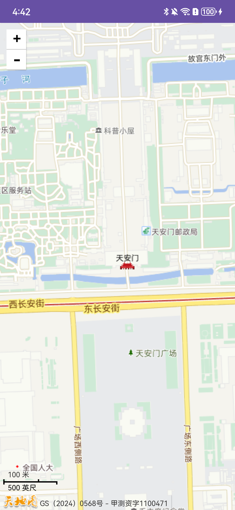
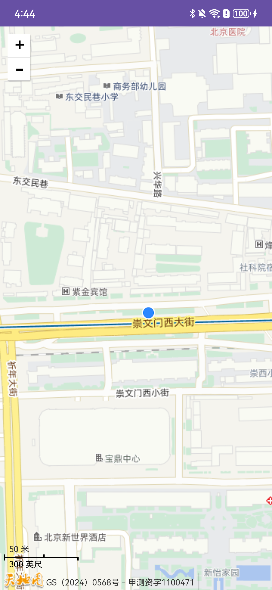

# Tianditu Android SDK

[TOC]

## 概述

这是对[天地图](https://www.tianditu.gov.cn/) [JavaScript API 4.0](http://lbs.tianditu.gov.cn/api/js4.0/guide.html)的简单封装，使其更便于在Android APP中使用。 目前，它还十分不完善，只添加了很少的一部分常用组件和接口。

|  |  |  |
| :----------------------------------------------------------- | ------------------------------------------------------------ | ------------------------------------------------------------ |

## 快速开始

### 必要的配置

#### 申请 API Key

参考[官方说明](http://lbs.tianditu.gov.cn/home.html)

#### 允许`HTTP`

目前天地图有些接口仍然使用`http`连接，默认情况下Android系统是不允许使用`http`请求的。因此，为了保证地图能够正常显示，我们需要先配置网络策略。

```xml
<?xml version="1.0" encoding="utf-8"?>
<network-security-config>
    <domain-config cleartextTrafficPermitted="true">
        <domain includeSubdomains="true">tianditu.gov.cn</domain>
    </domain-config>
    <base-config cleartextTrafficPermitted="false" />
</network-security-config>
```
有关更详细内容，请参考：[Android Security Config](https://developer.android.com/privacy-and-security/security-config)。

#### 定位权限

```xml
<uses-permission android:name="android.permission.INTERNET" />
<uses-permission android:name="android.permission.ACCESS_FINE_LOCATION" />
<uses-permission android:name="android.permission.ACCESS_COARSE_LOCATION" />
```

> **定位权限**还需要在应用中动态申请。

### 初始化

提供了四个初始化方法，对应两种初始化方式。

**方式一**

```java
TMapInitializer.initialize("your_api_key");

// or

// TMapOptions options = new TMapOptions();
// options.zoom = 16;
// TMapInitializer.initialize("your_api_key", options);
```

**方式二**

在`AndroidManifest.xml`中添加以下条目
```xml
<application>
    <meta-data
        android:name="cn.gov.tianditu.API_KEY"
        android:value="your_api_key" />
</application>
```

```java
TMapInitializer.initialize(applicationContext);

// or

// TMapOptions options = new TMapOptions();
// options.zoom = 16;
// TMapInitializer.initialize(applicationContext, options);
```

> 建议在`Application`类中做初始化操作。

### 显示地图

```xml
<cn.touchair.tianditu.map.TMapView
    android:layout_width="match_parent"
    android:layout_height="match_parent" />
```

属性：

| Attribute                 | Type      | Default value    |
| ------------------------- | --------- | ---------------- |
| `app:showZoomControl`     | `Boolean` | `false`          |
| `app:zoomControlGravity`  | `Enum`    | `left_of_top`    |
| `app:showScaleControl`    | `Boolean` | `false`          |
| `app:scaleControlGravity` | `Enum`    | `left_of_bottom` |
| `app:showMapTypeControl`  | `Boolean` | `false`          |

### 显示位置

```java
TMapLocationManager lm = new TMapLocationManager(this) {
    @Override
    public void onLocationChanged(@NonNull Location location) {
        super.onLocationChanged(location);
        binding.mapView.setMyLocation(new TLngLat(location));
    }
};
if (ActivityCompat.checkSelfPermission(this, Manifest.permission.ACCESS_FINE_LOCATION) != PackageManager.PERMISSION_GRANTED) {
    return;
}
lm.startLocation();
```

### 控件类

#### 缩放控件（Zoom）

参见[TMapView属性](#显示地图)

#### 比例尺（Scale）

参见[TMapView属性](#显示地图)

#### 地图类型（MapType）

参见[TMapView属性](#显示地图)

#### 版权说明（Copyright）

默认情况下版权控件是禁用的，需要通过初始化选项启用该控件。

```java
TMapOptions options = new TMapOptions();
options.enableCopyrightControl = true;
TMapInitializer.initialize("your_api_key", options);
```

**添加版权**

```java
binding.mapView.addCopyright(new TCopyright("some_unique_id", "Copyright (C) 2022 Tianditu. All rights reserved."));
```

**删除版权**

```java
binding.mapView.removeCopyright("some_unique_id");
```

### 覆盖物类

#### 标记（Marker）

**添加标记**

```java
// add default style marker
binding.mapView.addMarker("some_unique_id", new TLngLat(location));

// or
// binding.mapView.addMarker("some_unique_id",new TMarker(new TLngLat(location), TIcon.PIN_RED));
```

**删除标记**

```java
binding.mapView.removeMarker("some_unique_id");
```

### 服务类

#### 逆地理编码

每调用一次`TMapView::setMyLocation(TLngLat lnglat)`方法，触发一次逆地理编码请求，我们只需要提前注册好用于接收的回调函数即可。

```java
binding.mapView.addLocationAddressUpdatedListener((lngLat, address) -> {
    
});
```

